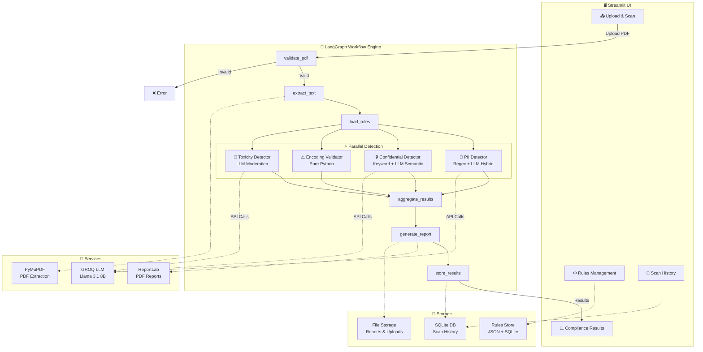
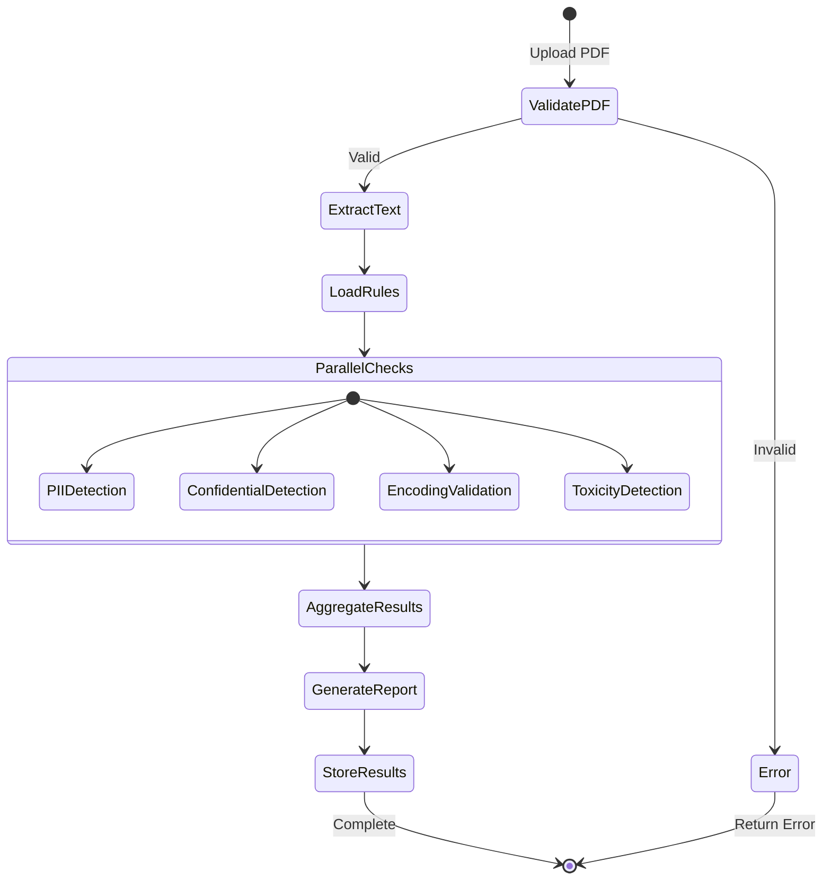

# System Architecture

## Architecture Diagram

## State Flow

## Technology Stack

| Layer | Technology | Purpose |
|-------|-----------|---------|
| Frontend | Streamlit | Web UI with interactive widgets |
| Orchestration | LangGraph | Stateful workflow management |
| AI/LLM | GROQ (Llama 3.1 8B) | Contextual compliance analysis |
| PDF Processing | PyMuPDF (fitz) | Text extraction and metadata |
| Data Models | Pydantic | Type-safe data validation |
| Database | SQLite | Scan history and rules storage |
| Reports | ReportLab | PDF report generation |
| Charts | Plotly | Interactive data visualization |
| Logging | Python logging | Structured application logging |

## Data Flow

1. **Input**: User uploads PDF via Streamlit UI
2. **Validation**: File size, type, PDF structure checked
3. **Extraction**: PyMuPDF extracts page-wise text
4. **Analysis**: 4 agents analyze text in parallel
5. **Aggregation**: Results merged, score calculated
6. **Reporting**: JSON + PDF reports generated
7. **Storage**: Results saved to SQLite
8. **Output**: Results displayed in dashboard
